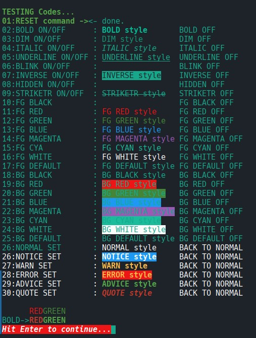

# HOLLYWOOD-MAL Libraries
**This is a collection of libraries I coded to help myself with my projects**
Maybe they are also usefull to other Hollywood coders so here they are :)

> Author  : Fabio Falcucci (Allanon)  
> E-mail Contact : info@a-mc.biz  
> Mastodon handle : https://mastodon.uno/@allanon  
> License : Freeware  

If you like my work support me on Patreon https://www.patreon.com/Allanon71  or with PayPal to hijoe@tin.it   

# IMPORTANT NOTE
From now (04/08/2020) I'm putting libraries using a global include file called **+Includes.hws** where all library names are defined along with their path, in order to run the examples you need to setup the variable **#INC_PATH** with the absolute path where you have saved/cloned the libraries, if you do this you will be able to run all the examples with a double click, for example let's suppose you have cloned the entire repository into the following path : `C:/MyHollywoodStuff/Libs/`  
All you have to do is:  
+ Open the file `+Includes.hws`  
+ Edit the line `Const #INC_PATH     = ""`  
+ Putting the absolute location, in our case `C:/MyHollywoodStuff/Libs/`  
+ Save the edited file  
+ You are ready!

---

# ANSI Library
 **Hollywood-MAL ANSI Library**

 []()
 
   Ansi library is an include file for Hollywood that will help you to manage ANSI escape codes so you can print colored text in the console of your host system.
 
   I’ve developed this library to have an invaluable help while I’m debugging applications because this way I’m able to spot on the fly errors and/or warning messages that are hilighted from the rest of the messages.
 
   Of course you need that your host system console is able to understand ANSI ascape codes, but almost any OS is able to do that… except Windows! 
   For the Windows OS you need to install any thirdy party application to accomplish the task, on my development machine, running Windows 10, I’m using **ansicon** program to make use of ANSI codes.

   After having developed the basic features, I had the need to run some applications on Linux console with simple menus to start/stop services and to show logs so I added the ability to create a full console app using this library with some pretty useful functions & methods and a complete menu system.

   At this stage this library has methods to draw lines & boxes, to show message boxes, input boxes, to show data into a scrollable grid and some other nice things.
   It's far for being complete but pretty simple as a basic library to build console applications.

**TODO**
+ Try to integrate the new features introduced in the latest versions of Hollywood
+ Get rid of the need to hit the ENTER key when waiting for a single key press

```plaintext
   Library file  : Ansi.hws
   Documentation : Ansi.readme
   Screenshot    : Ansi.jpg
   Version       : 1.7 (November 2024)
   Dependancies  : -
   Examples      : 3 examples provided in Examples/Ansi/ folder
   Compatibility : This library is compatible with all system supporting ANSI escape sequences,
                   inbuilt commands in Hollwyood >10 are only compatible with Linux, Windows
                   and MacOS.
```

---

# Lib-Date&Time
 **Hollywood-MAL Date & Time Library**
 This library holds some useful methods and functions to handle dates, source code is full with comments and examples, here is the list:

CONTENTS
```plaintext
FUNCTIONS
  DT.DateToDays(dd, mm, yy)
  DT.DaysToDate(days, format)
  DT.GetMonthDays(monthNum, year)
  DT.IsLeap(Year)
  DT.MillisecondsToTime(MS, decimal)
  DT.MinutesToTime(mins)
  DT.MonthToNumber(month)
  DT.NDate_AddDays(dd, mm, yy, days)
  DT.NumberToMonth(month)
  DT.SDate_AddDays(sDate, days)
  DT.SecondsToTime(secs)
  DT.TimeToMinutes(Tim)
  DT.TimeToSeconds(Tim)
  DT._anyToSeconds(arg)
  
OBJECTS/METHODS
  TimeObj:Add(tObj)
  TimeObj:New(timedef)
  TimeObj:NewFileLastChange(filename)
  TimeObj:NewNow()
  TimeObj:Sub(tObj)
  TimeObj:dbgPrint()
  TimeObj:equalTo(tObj, threshold)
  TimeObj:fromSeconds(seconds)
  TimeObj:fromString(s, mode)
  TimeObj:fromUnixTimeStamp(timestamp)
  TimeObj:greaterThan(tObj, threshold)
  TimeObj:lesserThan(tObj, threshold)
  TimeObj:toSeconds()
  TimeObj:toString(fmt)
  TimeObj:toUnixTimeStamp()

TESTS
  DT.TEST()
```

# Lib-Helpers
 **Hollywood-MAL Helpers Library**
 
 This library includes a collection of common utility functions and methods, please refer to the **helpers.html** file fo a detailed description.

CONTENTS
```plaintext
:: BUFFERED STRING OBJECT ::
HL.BufferedString:AddChar()
HL.BufferedString:AddString()
HL.BufferedString:Get()
HL.BufferedString:New()
HL.BufferedString:PrepareForRead()
HL.BufferedString:Read()
HL.BufferedString:Set()

:: COLOR OBJECT ::
HL.Color:Brighten()
HL.Color:Clone()
HL.Color:Darken()
HL.Color:New()
HL.Color:fromARGB()
HL.Color:fromValue()
HL.Color:toARGB()
HL.Color:toRGB()
HL.GetRndColor()

:: STRINGS ::
HL.Capitalize()
HL.CutBetweenLimits()
HL.CutStringLeft()
HL.CutStringRight()
HL.GetBetweenLimits()
HL.GetReversedDateTime()
HL.GetRndName()
HL.SizeString()

:: NUMBERS ::
HL.RoundBig()
HL.Value2Perc()

:: CONVERSIONS ::
HL.Convert.BytesTo()
HL.Convert.ForTextout()
HL.Convert.HTML2Hollywood()
HL.Convert.HTMLAmper2UTF8()
HL.Convert.HTMLTag2HollywoodTag()
HL.Convert.Unicode2UTF8()

:: INPUT ::
HL.Input.CheckJoystick()
HL.Input.CheckKeyboard()
HL.WaitForAction()

:: MISC ::
HL.IsNil()
HL.IsNotNil()
HL.LineHook.Enable()
HL.LineHook.Disable()
HL.NBWait()
HL.ParseRunArgs()
HL.RestartApp()
 ```
 
# Lib-Easing
 **Hollywood-MAL Easing Library**
 
 Easing library is an include file for Hollywood able to create very smooth transitions between values so you can use it to animate almost anything like: graphical objects, colors, values, and any value you  need to be smoothly changed into another value.
 For detailed informations have a look at **easing.md** file.
 
CONTENTS
```plaintext
tween.start(time, subject, target, easing, callback, ...)
tween.reset(id)
tween.resetAll()
tween.update(dt)
tween.stop(id, callback)
tween.stopAll(callback)
tween.count()
tween.TEST()
```

# Lib-Tables  
 **Hollywood-MAL Tables Library**
 
 Tables library is an include file for Hollywood with several functions to manipulate tables, including comparisons, merge, set, sort, push, shift and many others. Please have a look at the file **tables.md** for more informations.
 
 CONTENTS
 ```plaintext
 :: TABLE COMPARISONS ::
 TB.Compare()
 TB.CompareScore()
 TB.Item.Comapare()
 TB.Item.Exists()
 TB.Item.Find()
 TB.Item.IsNil()
 
 :: TABLE CONVERSIONS ::
 TB.Convert.String2Table()
 TB.Convert.Table2String()
 TB.Serialize()
 TB.Deserialize()
 
 :: TABLE HANDLING ::
 TB.Fill()
 TB.Interpolate()
 TB.Join()
 TB.Merge()
 TB.PushDown()
 TB.PushDown()
 TB.Reindex()
 TB.ReplaceChars()
 TB.Set()
 TB.ShiftDown()
 TB.ShiftUp()
 TB.Sort()
 
 :: MISC ::
 TB.Copy()
 TB.Count()
```

# Lib-Debug
 **Hollywood-MAL Debug Library**
 
 Debug library is a library developed to help debugging session, it can be used to
 generate debug output to the console or to a one or more files, both debug output can use ANSI colors or plain text.
 
 Debug library can manage one or more debug channels so that you are able to switch
 on or off single channels and reduce the amount of output to analyze, this is very useful for complex programs involving several includes or libraries.
 
 If you have an ANSI capable terminal debug messages can be colored to help
 you identify errors and warning in no time.
 
 Debug library has the ability to show nested messages, this is incredibly useful
 when you have recursive functions and external library calls: without a proper
 output formatting a standard debug session could become a pain.
 
 You can output tables too, and they are formatted and idented properly to let
 you look easily at their contents.
 
CONTENTS
```plaintext
 :: CONSOLE DEBUG ::
 DBG.Console.AddChannel()
 DBG.Console.Disable()
 DBG.Console.Enable()
 DBG.Console.Out()
 DBG.Console.RemoveChannel()
 DBG.Console.SkipNormalLevel() ; OBSOLETE
 DBG.Console.ignoreNormalMsg()
 
 :: FILE DEBUG ::
 DBG.Log.Disable()
 DBG.Log.Enable()
 DBG.Log.Out()
 
 :: MISC ::
 DBG.DumpTable()
```

# Lib-GFX
**Hollywood-MAL GFX Library**
 
  GFX library is an include file for Hollywood that helps with common
graphical-related operations. Some example are provided inside the library as functions, look at the bottom of the source code.

 **CONTENTS**
 ```plaintext
 :: BACKGROUND UTILITIES ::
 - GFX.BG.Setup()
 - GFX.BG.Show()
 - GFX.BG.Free()

 :: BRUSH UTILITIES ::
 - GFX.Brush.HShift()
 - GFX.Brush.VShift()

 :: DISPLAY UTILITIES ::
 - GFX.DisplayExists()
 - GFX.GetHostSize()
 - GFX.SafeClipRegion()
 
 :: OUTPUT DEVICE UTILITIES ::
 - GFX.OutputDevice.EndSelect()
 - GFX.OutputDevice.Select()
 - GFX.OutputDevice.GetCurrent()
 
 :: FONT OBJECT ::
 - GFX.Font:New()
 - GFX.Font:Save()
 - GFX.Font:Load()
 - GFX.Font:Apply()
 - GFX.Font:Set()
 
 :: IMAGE OBJECT ::
 - GFX.Image:Add()
 - GFX.Image:Clone()
 - GFX.Image:Draw()
 - GFX.Image:NewLayer()
 - GFX.Image:Reload()
 - GFX.Image:Remove()
 - GFX.Image:Resize()
 - GFX.Image.Get()
 - GFX.Image.List()
 
 :: IMAGE FX UTILITIES ::
 - GFX.ImageFX.AddFrame()
 - GFX.ImageFX.Reflex()
 - GFX.ImageFX.Scale()

 :: TEXT UTILITIES ::
 - GFX.Text.DeTagger()
 - GFX.Text.GetWidth()
 - GFX.Text.WordWrap()
```
# Lib-FS
**Hollywood-MAL FS Library**

  FS is a library developed to help with common file system related
 operations.

**CONTENTS**
```plaintext
 :: MISC ::
 FS.AppDataLocation()
 FS.CutLastFolder()
 FS.OpenFolder()
 FS.ParseFilename()
 
 :: TASKS ::
 FS.Task.IsRunning()
 FS.Task.Kill()
 
 :: SCRIPTS ::
 FS.Build_Script()
 FS.ExecuteSynch_SCript()
 FS:Execute_Script()
 
 :: CONFIG FILES ::
 FS.Config.Add()
 FS.Config.Load()
 FS.Config.Remove()
 FS.Config.Set()
 FS.Config.Write()
 
 :: FILES ::
 FS.Files.ChangeExistingName()
 FS.Files.CheckLastChar()
 FS.Files.ClearCache()
 FS.Files.Delete()
 FS.Files.ExtractFromZip()
 FS.Files.Find()
 FS.Files.FindByCRC32()
 FS.Files.GetDirectories()
 FS.Files.GetExtention()
 FS.Files.GetLastLine()
 FS.Files.GoDirectoryUp()
 FS.Files.IsAvailable()
 FS.Files.IsPathRelative()
 FS.Files.LoadToTable()
 FS.Files.Open()
 FS.Files.ReadFloat()
 FS.Files.ReadString()
 FS.Files.ReadTable()
 FS.Files.RemoveExtention()
 FS.Files.SaveFromTable()
 FS.Files.Script_Build()
 FS.Files.Search()
 FS.Files.ToTable()
 FS.Files.Validate()
 FS.Files.WriteInt()
 FS.Files.WriteString()
 FS.Files.WriteTable()
 FS.Files.applyQuotes()
 
 :: INI FILES ::
 FS.Ini.ReadValue()
 
 :: TEXT FILES ::
 FS.TxtFiles.InsertBefore()
 
 :: VOLUMES ::
 FS.Volumes.ClearCache()
 FS.Volumes.Get()
 FS.Volumes.GetPart()
 FS.Volumes.IsAvailable()
 FS.Volumes.Monitor_Check()
 FS.Volumes.Monitor_Start()
 FS.Volumes.Monitor_Stop()
```
 
# Lib-G2D
 **Hollywood-MAL G2D Library**
 
 G2D Library is an include file for Hollywood that helps with graphics
 related objects and functions, it also has a full-featured skinning 
 system.
 
CONTENTS
```plaintext
 :: POINT 2D OBJECT ::
 G2D.Point:New()
 G2D.Point:Distance()
 G2D.Point:DotProduct()
 G2D.Point:MidPoint()
 G2D.Point:Normal2D()
 G2D.Point:Normalize()
 G2D.Point:Rotate()
 G2D.Point:Scale()
 
 :: POLYGON OBJECT ::
 G2D.Poly:New()
 G2D.Poly:Collide()
 G2D.Poly:Draw()
 G2D.Poly:Project()
 G2D.Poly:SetAnchor()
 G2D.Poly:SetAngle()
 G2D.Poly:SetScale()
 G2D.Poly:Translate()
 
 :: AREA OBJECT ::
 G2D.Area:New()
 G2D.Area:Box()
 G2D.Area:FillColor()
 G2D.Area:FillPattern()
 G2D.Area:Move()
 G2D.Area:Scale()
 G2D.Area:SkinBevel()
 G2D.Area:SkinColor()
 G2D.Area:SkinFitMax()
 G2D.Area:SkinFitMin()
 G2D.Area:SkinGradient()
 G2D.Area:SkinHPattern()
 G2D.Area:SkinHPattern3S()
 G2D.Area:SkinMulti()
 G2D.Area:SkinPattern()
 G2D.Area:SkinPattern9S()
 G2D.Area:SkinQuick()
 G2D.Area:SkinShades()
 G2D.Area:SkinStretch()
 G2D.Area:SkinVPattern()
 G2D.Area:SkinVPattern3S()
 G2D.Area:Snapshot()
 
 :: BG Picture ::
 G2D.BGPic.CreateSkinned()
``` 

# Lib-JSON
 **Hollywood-MAL JSON Decoder Library**
 
 JSON Lib is an include file with the unique purpose to decode JSON strings into
 Hollywood tables.
 
**CONTENTS**
```plaintext
:: Main Functions ::
 JSON.Decode()
 
 :: Support Functions ::
 JSON._IsArrayEnded()
 JSON._IsObjectEnded()
 JSON._ReadArray()
 JSON._ReadNumber()
 JSON._ReadObject()
 JSON._ReadPair()
 JSON._ReadString()
 JSON._ReadValue()
``` 

# Lib-SLT
 **Hollywood-MAL Sliding Text Library**
 
The aim of this library is to handle scrolling texts using layers, this will enable the coder to use layer's advanced features without the need to process the scrolling text graphics.
The library supports many events that are triggered in various situation and can be used to produce great visuals, for example it supports the **OnBeforeUpdate** and **OnAfterUpdate** that can be used to manage a background and a foreground with the scrolling text in the middle.
Have a look at the TEST 02 to see how it works, TEST 01 instead shows why it is nice to render the scrolling text into layers.

**CONTENTS**
```plaintext
:: FUNCTIONS ::
- SLT.Init()
- SLT.Update()
- SLT.Free()
- SLT.Pause()
- SLT.Resume()
 
:: TASK CLASS ::
- SLT.TaskObject:New()
- SLT.TaskObject:Draw()
- SLT.TaskObject:Update()
- SLT.TaskObject:Pause()
- SLT.TaskObject:Resume()
- SLT.TaskObject:Remove()

:: EXAMPLES/TESTS ::
- SLT.TEST_01()
- SLT.TEST_02()
``` 

 ---
